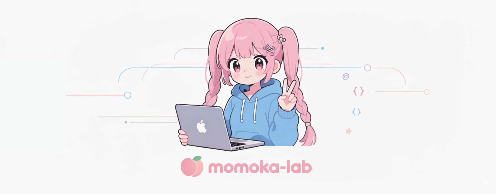

  <picture>
    <source media="(prefers-color-scheme: dark)" srcset="../banner-dark.png">
    <source media="(prefers-color-scheme: light)" srcset="../banner-light.png">
    
  </picture>

  
# Momoka Lab

*Researching kawaii. かわいい研究中。*

 

Welcome to **Momoka Lab**! A digital laboratory dedicated to exploring the essence of *kawaii* through code.
We're crafting delightful digital experiences for everyone who loves anime and otaku culture.

**[momoka.dev](https://momoka.dev)**

---
 

### 🚧 Lab Under Construction 🚧

> Our lab is currently in its setup phase! We're busy mixing potions (and writing code, of course). Please pardon the dust as we prepare our experiments. Amazing things are on the way! ✨

 

---
 

### 🌸 Join the Experiment!

Momoka Lab always welcomes new ideas and contributions. Feel free to explore our repositories, and if you have a fun idea, don't hesitate to share it with us!

 

  
Thank you for visiting!

